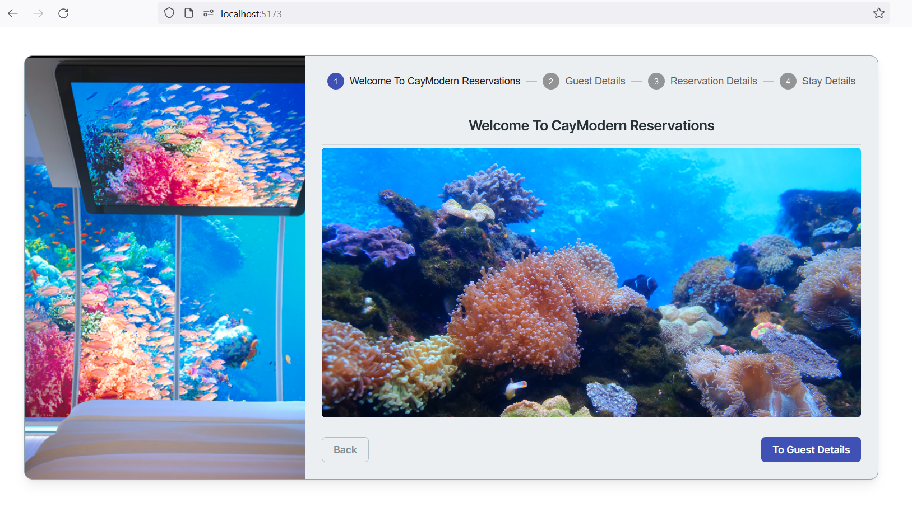
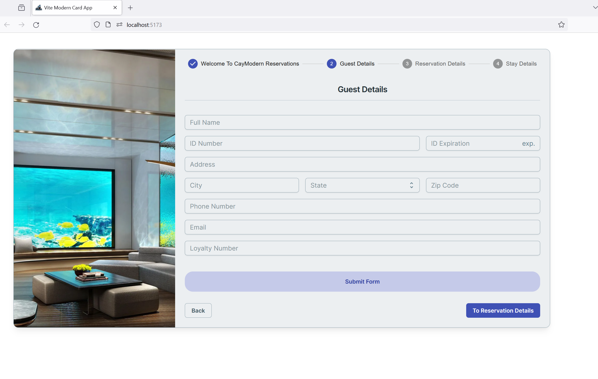
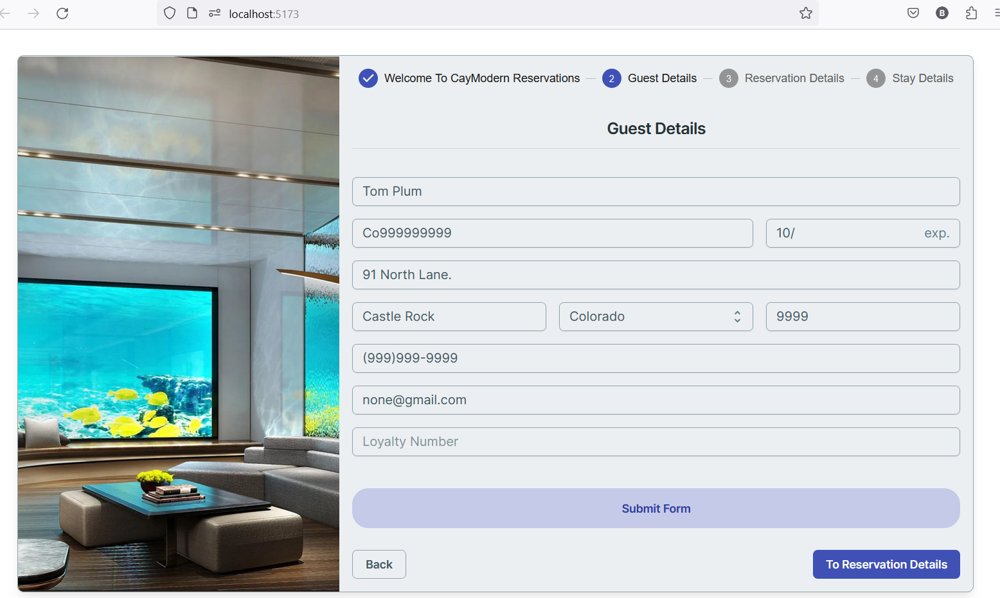
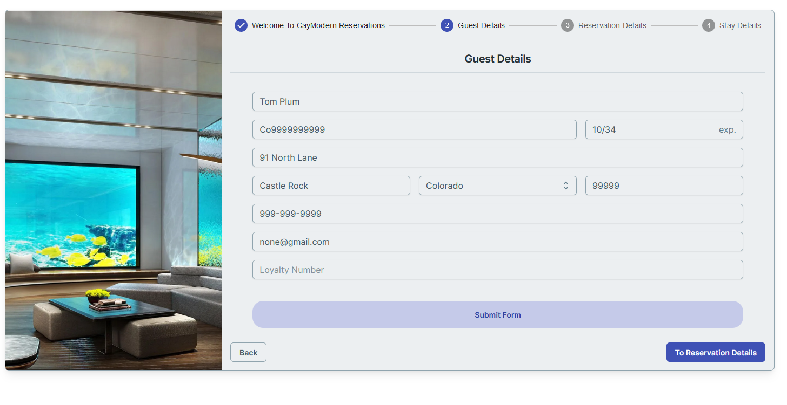
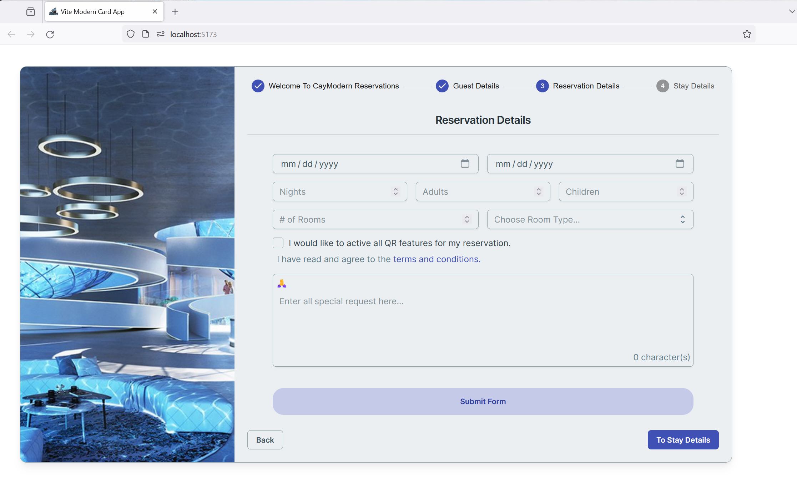
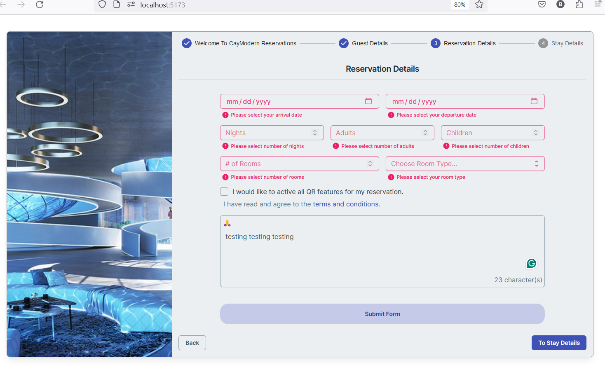
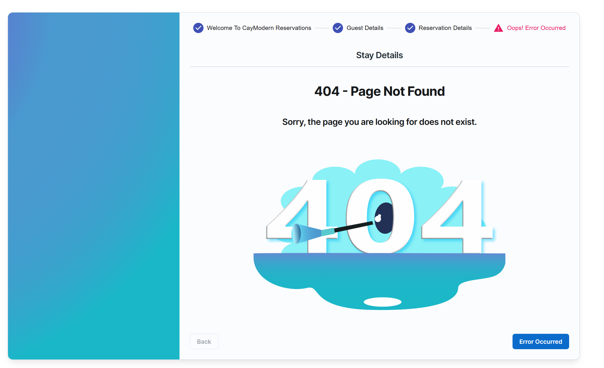

# Vite-Modern-Card-Form

## :rocket: Overview

Vite Modern Card App is a sophisticated web application developed using Vite, a next-generation front-end build 
 tool that leverages the power of ES Modules for faster and leaner development. The application is built using JavaScript, a high-level, interpreted programming language that conforms to the ECMAScript specification.

The application's user interface is constructed using React, a declarative, efficient, and flexible JavaScript library for building user interfaces. React's component-based architecture allows for the creation of complex UIs from isolated and reusable pieces of code called components.

The application's main feature is the display of information using card components. Each card component is a self-contained unit with its own view (markup) and logic (JavaScript). The card components are designed to be reusable and customizable, making it easy to display different types of content with a consistent look and feel.

The application also utilizes npm, the default package manager for the Node.js JavaScript runtime environment. npm is used to manage the project's dependencies, which include external libraries and frameworks that provide additional functionality or help to structure the codebase.

The Vite Modern Card App is designed with modern UI/UX principles in mind, providing a clean, intuitive, and responsive user experience. The application's responsive design ensures that it looks and functions well on a variety of devices and screen sizes.

The application's codebase is organized according to best practices for Vite and React applications, with a clear separation of concerns between components, logic, and data. This structure makes the codebase easier to navigate and maintain, and it allows for efficient collaboration among multiple developers.

In summary, the Vite Modern Card App is a modern, well-structured web application that showcases the power and flexibility of Vite, React, and JavaScript.

## :gear:  Technologies Used

- **Vite**: A build tool that is designed to provide a faster and leaner development experience for modern web projects.
- **JavaScript**: The primary programming language used for developing the application logic.
- **React**: A JavaScript library for building user interfaces.
- **Mui Joy**: A comprehensive library of UI components for building user interfaces in React applications.
  It is part of the MUI ecosystem, which is a popular
- open-source project that provides a set of React components for faster and easier web development.
- **React Router**: A library that provides routing capabilities for React applications. It allows developers to define routes and navigation logic in a declarative way.
- **Vitest**: A testing framework for Vite applications. It provides utilities for writing and running tests for Vite 
  projects.
- **React UseForm**: A custom React Hook from the react-hook-form library. It is used to manage form state and form validation in a React application. The useForm hook returns an object with methods that can be used to register form fields, handle form submission, validate form fields, and manage form state.
- **npm**: A package manager for JavaScript, used for managing project dependencies.

## :stars:  Features

- **Card Display**: The application displays information using card components. Each card can contain various elements such as text, images, and buttons.
- **Modern UI**: The application uses modern UI design principles to provide a clean and intuitive user experience.

## :file_folder: Project Structure

The project follows a standard structure for a Vite and React application. Here's a brief overview of the main directories and files:

- `src/`: This directory contains all the source code for the application. It includes components, logic, and data files.
- `src/components/`: This directory contains all the React components used in the application.
- `src/logic/`: This directory contains JavaScript files that handle the application logic.
- `src/data/`: This directory contains data that the application uses to populate the card components.
- `package.json`: This file contains metadata about the project and its dependencies.

## :framed_picture: Screenshots

### Screenshots

